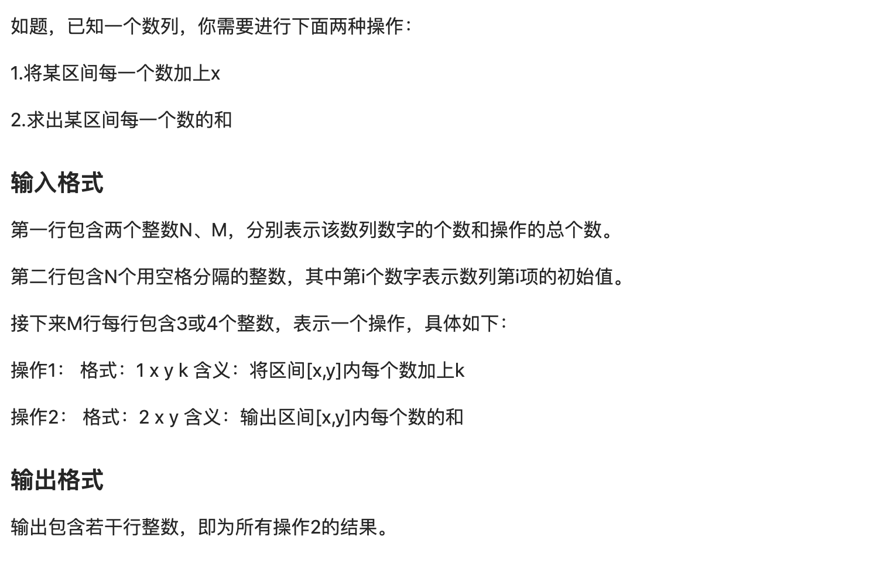
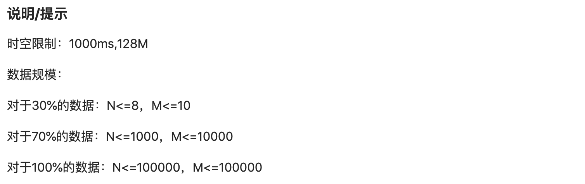

# 线段树模版   





```c++
#include <bits/stdc++.h>

#define MAXN 100005
using namespace std;

inline int ls(int p) { return p << 1; }

inline int rs(int p) { return p << 1 | 1; }

struct node {
    int l, r, sum;

    //  node *left, *right;
    node() {}

    node(int l, int r, int sum) : l(l), r(r), sum(sum) {}
};

node s[MAXN * 4 + 2];

int nums[MAXN];
int N, M;

void build(int arr[], int root, int l, int r) {
    s[root].l = l;
    s[root].r = r;
    if (l == r) {
        s[root].sum = arr[l];
        return;
    }
    int mid = (r + l) >> 1;
    build(arr, ls(root), l, mid);
    build(arr, rs(root), mid + 1, r);
    s[root].sum = s[ls(root)].sum + s[rs(root)].sum;
}

void add(int root, int l, int r, int x) {
    if (s[root].l == l && s[root].l == s[root].r) {
        s[root].sum += x;
        return;
    }
    int mid = (s[root].l + s[root].r) >> 1;
    if (l > mid)
        add(rs(root), l, r, x);
    else if (r <= mid)
        add(ls(root), l, r, x);
    else {
        add(ls(root), l, mid, x);
        add(rs(root), mid + 1, r, x);
    }
    s[root].sum = s[ls(root)].sum + s[rs(root)].sum;
}

int find(int root, int l, int r) {
    if (l > s[root].r || r < s[root].l)
        return 0;
    if (l <= s[root].l && r >= s[root].r) {
        return s[root].sum;
    }
    int mid = (s[root].l + s[root].r) / 2;
    if (r <= mid)
        return find(ls(root), l, r);
    if (l > mid)
        return find(rs(root), l, r);
    return find(ls(root), l, mid) + find(rs(root), mid + 1, r);
}

int main() {

    // freopen("input.txt", "r", stdin);

    cin >> N >> M;
    for (int i = 1; i <= N; i++)
        cin >> nums[i];
    build(nums, 1, 1, N);
    while (M--) {
        int op, x, y, k;
        cin >> op;
        if (op == 1) {
            cin >> x >> y >> k;
            add(1, x, y, k);
        } else {
            cin >> x >> y;
            cout << find(1, x, y) << endl;
        }
    }

    return 0;
}
```

