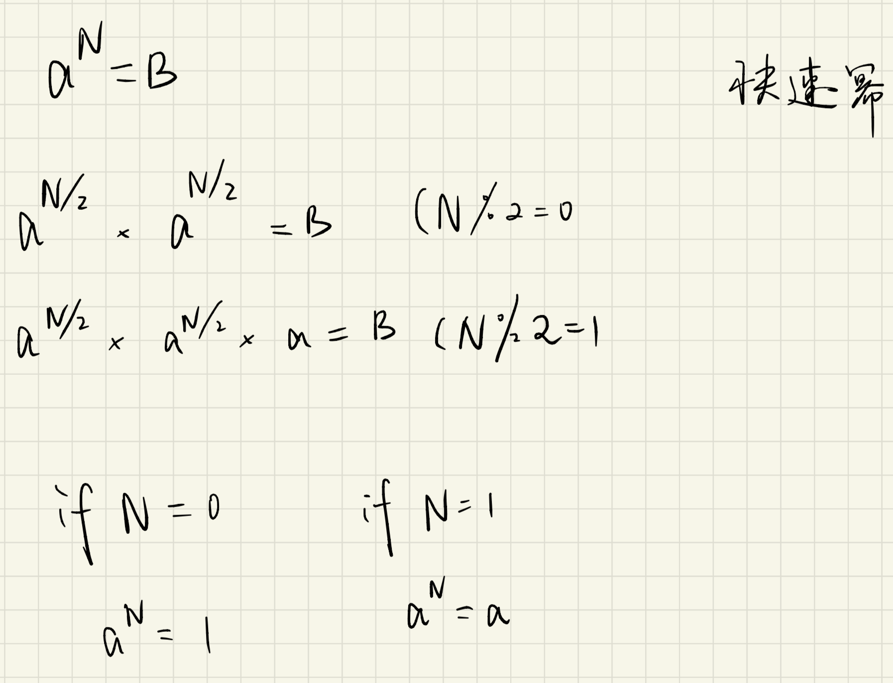
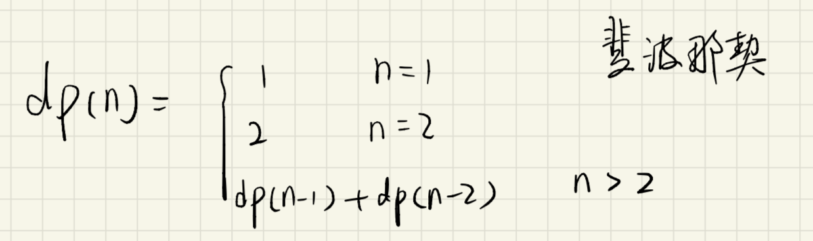
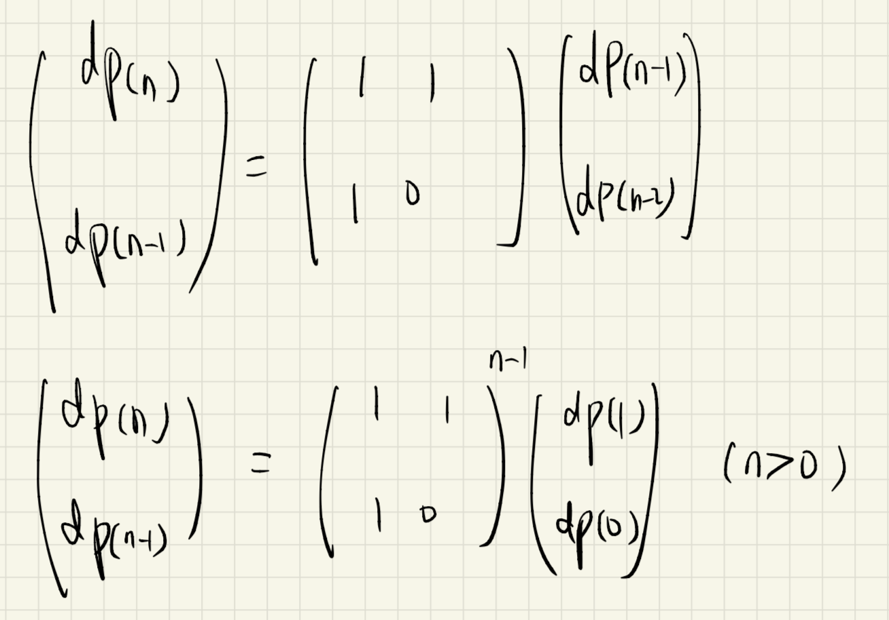
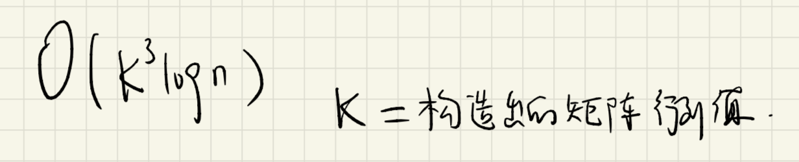
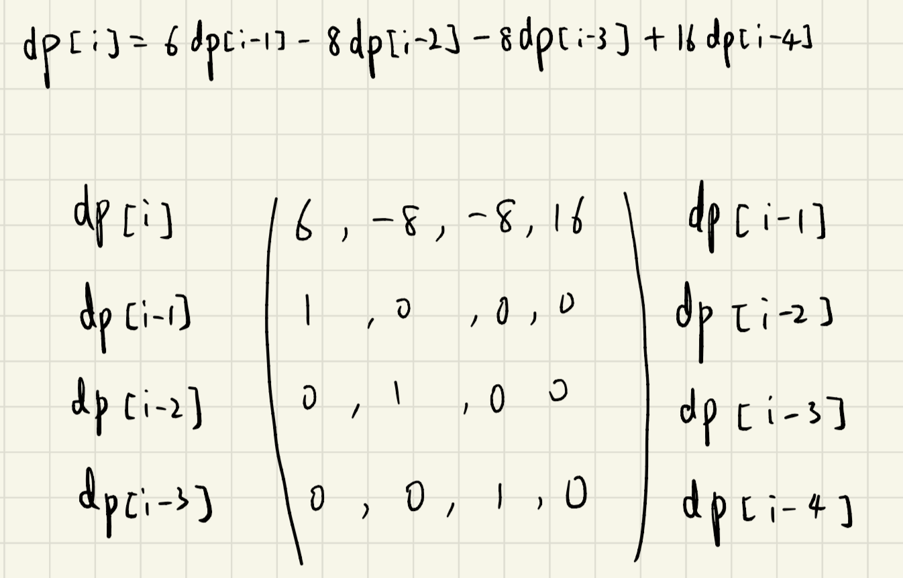

# 快速幂和矩阵快速幂 

### 快速幂  



```c
#include <iostream>

using namespace std;

int pow(int a,int n){
    if(!a)return 0;
    if(n==0)return 1;
    if(n==1)return a;
    int half=pow(a,n/2);
    if(n%2)
        return half*half*a;
    return half*half;
}

int main(){
    printf("4^7=%d,3^8=%d",pow(4,7),pow(3,8));
    return 0;
}
```

### 矩阵快速幂

eg用斐波那契数列



斐波那契数列的递推式子

用矩阵表示



通过上边这个式子 可以在O(k^3logn)的复杂度下计算斐波那契数列的第n个元素



模拟矩阵乘法的复杂度是O(k^3)

需要乘法的次数复杂度是O(logn)

###### 另一个例子



这个递推公式描述的数列是下边这个样子

`2, 24, 96, 416, 1536, 5504, 18944, 64000, 212992, 702464, 2301952, 7512064 ....`


##### 动手写一个矩阵相乘的算法吧

```go
package main

import "fmt"

// 本函数只能给同阶方阵使用
func mul(ma, mb [][]int) [][]int {
	size := len(ma)
	res := make([][]int, size)
	for i := 0; i < size; i++ {
		res[i] = make([]int, size)
	}

	for i := 0; i < size; i++ {
		for j := 0; j < size; j++ {
			res[i][j] = 0
			for k := 0; k < size; k++ {
				res[i][j] += ma[i][k] * mb[k][j]
			}
		}
	}

	return res
}

func main() {
	ma := [][]int{{6, -8, -8, 16}, {1, 0, 0, 0}, {0, 1, 0, 0}, {0, 0, 1, 0}}
	mb := [][]int{{6, -8, -8, 16}, {1, 0, 0, 0}, {0, 1, 0, 0}, {0, 0, 1, 0}}
	fmt.Println(mul(ma, mb))
}
```

