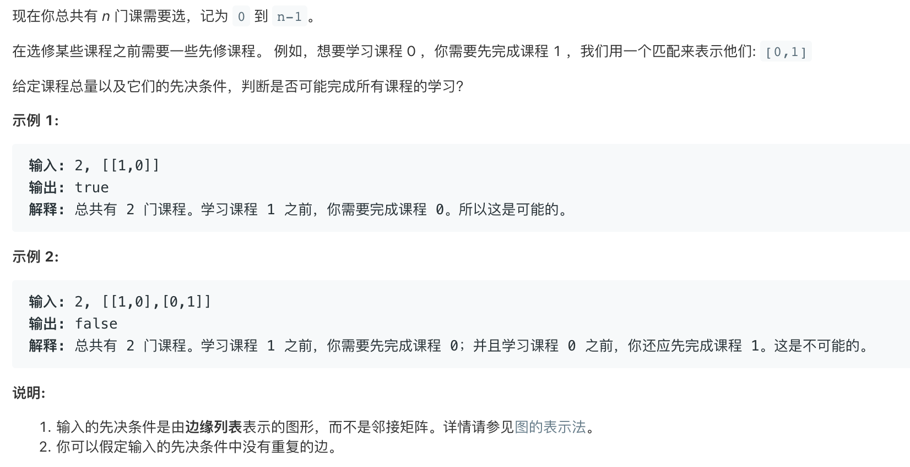
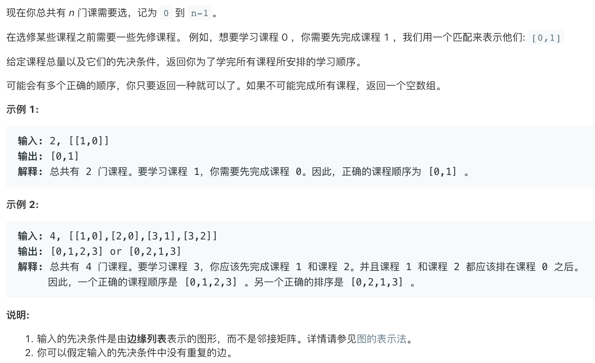

# 拓扑排序

拓扑排序 可以判断图有没有环 判断比输出拓扑排序结果骚微简单一点😂

##### 判断题 



```cpp
// 判断图是否有环
// 随便选一个点 开始dfs 如果dfs过程中回到了本身 那肯定有环
// int vis[]数组存放访问状态 0表示未访问 1表示已访问 -1表示正在访问
// 什么是正在访问 就是对一个点进行dfs的时候就是正在访问 dfs结束后才是已经访问
class Solution {
public:
    int* vis; // 存放访问情况;
    bool canFinish(int numCourses, vector<vector<int>>& prerequisites) {
        vector<vector<int>>g(numCourses,vector<int>(0));    
        for(auto&c:prerequisites){
            g[c[1]].push_back(c[0]);
          	// 按照题目意思构造图
        } 
        // 开辟空间并且初始化
        vis=new int[numCourses];
        memset(vis,0,sizeof(int)*numCourses);

        for(int i=0;i<numCourses;i++){
           // 对每个点进行拓扑dfs
            if(!vis[i]&&!topology(i,g))return false;
        }
      
        return true;
    }

    bool topology(int start,vector<vector<int>>& g){
        if(vis[start]==-1)return false;// 有环
        vis[start]=-1;// 正在访问
        for(auto&next:g[start]){
            if(vis[next]!=1&&!topology(next,g))return false;
        }
        vis[start]=1;// 访问结束
        return true;
    }
};
```

##### 判断+输出结果



```cpp
class Solution {
public:
    vector<int> ans; // 保存结果
    vector<int> vis; // 保存访问状态 同上

    vector<int> findOrder(int numCourses, vector<vector<int>> &prerequisites) {
        vector<vector<int>> g(numCourses);
        for (auto it:prerequisites) {
            g[it[1]].push_back(it[0]);
        }
        vis.assign(numCourses, 0);
        ans.assign(numCourses, 0);
        int course = numCourses - 1;
        for (int i = 0; i < numCourses; i++) {
            if (!vis[i]) {
                course = topsort(course, i, g);
                if (course == -2)return vector<int>(0);
            }
        }
        return ans;
    }

    int topsort(int n, int cur, vector<vector<int>> &g) {
        vis[cur] = -1;
        for (int next : g[cur]) {
            if (vis[next] == -1)return -2; //返回-2表示有环
            if (vis[next] == 1)continue;
            n = topsort(n, next, g);
            if (n == -2)return -2;
        }
        vis[cur] = 1;
        ans[n] = cur;
        return --n;
    }
};
```

