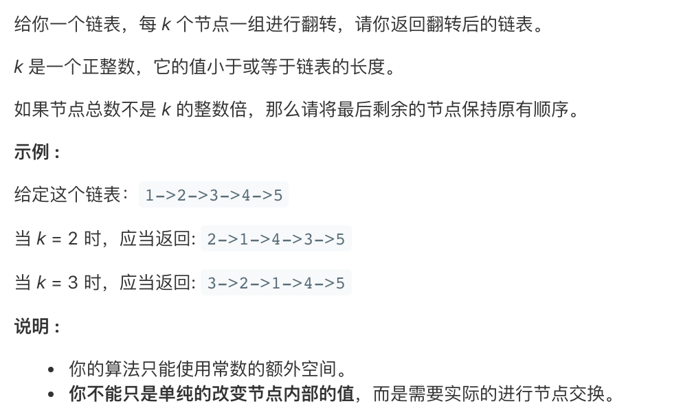

# 链表

#### 链表翻转(字节跳动2019秋招后端现场二面题



```cpp
/**
 * Definition for singly-linked list.
 * struct ListNode {
 *     int val;
 *     ListNode *next;
 *     ListNode(int x) : val(x), next(NULL) {}
 * };
 */
class Solution {
public:
    ListNode*NEXT;
    ListNode*front_tail=NULL;
    ListNode* reverseKGroup(ListNode* head, int k) {
        if(!head)return NULL;
        int len=0;
        auto tmp=head;
        while(tmp){
            tmp=tmp->next;
            len++;
        }
        if(k>len)return head;
        NEXT=head;
        ListNode*new_head=reverse(NEXT,k);
        
        for(int i=0;i<len/k-1;i++){
            auto f_t=front_tail;
            f_t->next=reverse(NEXT,k); 
        }
        front_tail->next=NEXT;
        return new_head;
    }
    /*
     * 给定一个合法的链表head 翻转起接下来k个节点 并且返回新的头
     */
    ListNode* reverse(ListNode*head,int k){
        front_tail=head;
        if(k==1){
            NEXT=head->next;
            return head;
        }
        ListNode* cur=head;
        ListNode* front=NULL;
        ListNode* next=head->next;
        while(k--){
            cur->next=front;
            front=cur;
            cur=next;
            next=next?next->next:NULL;
        }
        NEXT=cur;
        return front;
    }
};
```

