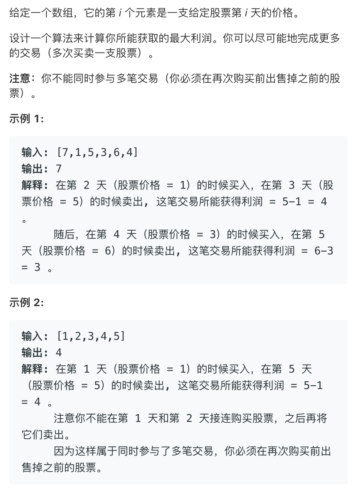

# 股票问题大合集😂


## 版本1


```cpp
// 这个思路好像不太像动态规划
// 1 2 4 3 6
// 1买进6卖出==1买进2卖出 然后2又买进4卖出 然后4买进3卖出 然后3买进6卖出
// 1->4积累了3元。 4->3损失了1元 还有2元>0
// 如果 序列是 1 2 4 0 6
// 那么 4->0损失了4元 1->4积累了3元 还他妈亏了1元
// 那干脆前面的交易都算了(1->2->4)   从0开始重新积累
class Solution {
public:
    int maxProfit(vector<int>& prices) {
        int cur=0;
        int ans=0;
        for(int i=1;i<prices.size();i++){
            cur=max(0,cur+prices[i]-prices[i-1]);
            ans=max(ans,cur);
        }
        return ans;
    }
};
```

```cpp
// 这个是动态规划转换过来的
// 先看最终版本 
// 然后看一步一步怎么推过来的
class Solution {
public:
    int maxProfit(vector<int>& prices) {
        if(!prices.size())return 0;
        int buy=-prices[0];
        int ans=0;
        int sell=0;
        for(int i=1;i<prices.size();i++){
            sell=buy+prices[i];
            ans=max(ans,sell);
            buy=max(0-prices[i],buy);
        }
        return ans;
    }
};
/*
第一步
dp[i][1][0]表示一种状态的最大利润 ，什么状态呢？
就是当前是第i天 还有一次购买股票的机会 目前手上有0张已经购买的股票 这种状态
按照题目的意思 只有一次买卖机会 也就是购买股票的机会最大是1 手头的股票数量最大也是1
😂
*/
/*
根据上边的描述可以写出下边的表达式
首先还有一次购买机会的时候 d[i][1][0]肯定是0
d[i][0][1]表示第i天手上有一个股票，那这个状态怎么转移呢？
第i天手上的股票可能是第i天买的 也可能不是第i天买的
如果是第i天买的 dp[i][0][1]=dp[i][1][0]-prices[i]
否则说明第i-1天的时候手上就已经有一个股票了 即dp[i-1][0][1]

那么对于dp[i][0][0]呢 第i天的时候没有股票，也不能买股票
那可能第i天把股票卖了也可能是第i-1天之前的某一天股票就没有了
如果是后者 dp[i][0][0]肯定等于0
*/
for(int i=1;i<prices.size();i++){
    dp[i][1][0] = 0;// 铁定的  对于所以i dp[i][1][0]==0
    dp[i][0][1] =max( dp[i][1][0] - prices[i], dp[i-1][0][1]);
    dp[i][0][0] = dp[i-1][0][1] + prices[i];
}
/*
对上边的进行整理 既然dp[i][1][0]始终=0
就代入
*/
for(int i=1;i<prices.size();i++){
    dp[i][0][1] =max( 0 - prices[i], dp[i-1][0][1]);
    dp[i][0][0] = dp[i-1][0][1] + prices[i];
}
/*
对上边的继续整理，发现dp[i][j][k]中 j 始终是0 
所以说明这个j对状态没有影响
去掉
*/
for(int i=1;i<prices.size();i++){
    dp[i][1] =max( 0 - prices[i], dp[i-1][1]);
    dp[i][0] = dp[i-1][1] + prices[i];
}
/*
继续化简
就是交换了语句的顺序，其实无所谓。
*/
for(int i=1;i<prices.size();i++){
    dp[i][0] = dp[i-1][1] + prices[i];
    dp[i][1] =max( 0 - prices[i], dp[i-1][1]);
}
/*
发现 第i天只依赖第i-1的状态
显然可以空间优化
直接用新的值覆盖老的值
*/
for(int i=1;i<prices.size();i++){
    sell=buy+prices[i];
    buy=max(0-prices[i],buy);
}

```


## 版本2




状态转移方程`dp[i][0]=max(dp[i-1][1]+prices[i],dp[i-1][0])` `dp[i][1]=max(dp[i-1][0]-prices[i],dp[i-1][1]);`

`dp[i][0]`表示第i天手上没有股票

`dp[i][1]`表示第i天手上有股票

```cpp
class Solution {
public:
    int maxProfit(vector<int>& prices) {
        if(!prices.size())return 0;
        int ans=0;
        vector<vector<int>>dp(prices.size(),vector<int>(2,0));
        dp[0][0]=0;
        dp[0][1]=-prices[0];
        for(int i=1;i<prices.size();i++){
            dp[i][0]=max(dp[i-1][1]+prices[i],dp[i-1][0]);
            dp[i][1]=max(dp[i-1][0]-prices[i],dp[i-1][1]);
            ans=max(ans,dp[i][0]);
        }
        return ans;
    }
};
```

发现第i天的状态和只第i-1天有关所以可以优化空间

```cpp
class Solution {
public:
    int maxProfit(vector<int>& prices) {
        if(!prices.size())return 0;
        int ans=0;
        int has=-prices[0];
        int none=0;
        for(int i=1;i<prices.size();i++){
            int pre_none=none;
            none=max(has+prices[i],none);
            has=max(pre_none-prices[i],has);
            ans=max(ans,none);
        }
        return ans;
    }
};
```


