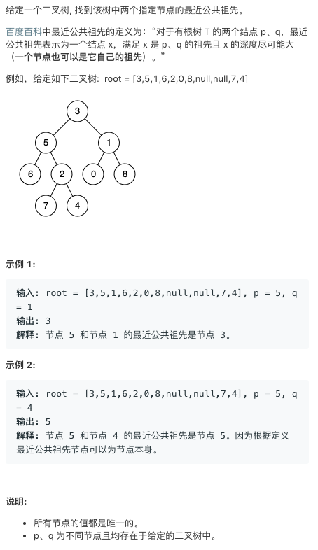

# tencent 235. Lowest Common Ancestor of a Binary Search Tree.go   
### 题目描述   



### 解题思路

大概的想法就是如果在该点，一个节点在其左子树，另外一个在其右子树，那么这个点就是公共点了。

然实现方式非常笨拙恶心。但是这个题好像面试常问。所以我就再实现一次用C++😂下边是原来的Go代码

```go
func lowestCommonAncestor(root, q, p *TreeNode) *TreeNode {
	if root == nil {
		return nil
	}
	r_find_q, r_find_p := find(root.Right, q, p)

	if root == q && r_find_p {
		return root
	}
	if root == p && r_find_q {
		return root
	}

	if r_find_p && r_find_q {
		if root.Right == p {
			return p
		}
		if root.Left == q {
			return q
		}
		return lowestCommonAncestor(root.Right, q, p)
	}

	l_find_q, l_find_p := find(root.Left, q, p)
	if root == q && l_find_p {
		return root
	}
	if root == p && l_find_q {
		return root
	}

	if l_find_p && l_find_q {
		if root.Right == p {
			return p
		}
		if root.Left == q {
			return q
		}
		return lowestCommonAncestor(root.Left, q, p)
	}

	if l_find_p && r_find_q || l_find_q && r_find_p {
		return root
	}

	return nil
}

func find(root, q *TreeNode, p *TreeNode) (bool, bool) {
	if root == nil {
		return false, false
	}
	//if root == q {
	//	return root == q, root == p
	//}
	l1, l2 := find(root.Left, q, p)
	r_1, r_2 := find(root.Right, q, p)
	return l1 || r_1 || root == q, l2 || r_2 || root == p
}
```

```cpp
/**
 * Definition for a binary tree node.
 * struct TreeNode {
 *     int val;
 *     TreeNode *left;
 *     TreeNode *right;
 *     TreeNode(int x) : val(x), left(NULL), right(NULL) {}
 * };
 */
class Solution {
public:
    TreeNode* ans;
    TreeNode* lowestCommonAncestor(TreeNode* root, TreeNode* p, TreeNode* q) {
        ans=NULL;
        dfs(root,p,q); 
        return ans;
    }
    
    int dfs(TreeNode* root, TreeNode* p, TreeNode* q){
        if(!root)return 0;
        int left=dfs(root->left,p,q);
        int right=dfs(root->right,p,q);
        int mid=(root==q||root==p)?1:0;
        if(left+right+mid>=2&&!ans)
            ans=root;
        return left+right+mid;
    }
};

```


如果这个二叉树 是一棵搜索二叉树 ，那么代码就非常干净了😂

```go

/**
 * Definition for TreeNode.
 * type TreeNode struct {
 *     Val int
 *     Left *ListNode
 *     Right *ListNode
 * }
 */
 func lowestCommonAncestor(root, p, q *TreeNode) *TreeNode {
     min:=p.Val
     max:=q.Val
     if min>q.Val{
         min=q.Val
         max=p.Val
     }
     if root.Val<min{
         return lowestCommonAncestor(root.Right,p,q)
     }
     if root.Val>max{
         return lowestCommonAncestor(root.Left,p,q)
     }
     return root
}
```

