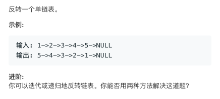

# Reverse Linked List   
### 题目描述   



### 解题思路

这道题被leetcode标记为简单题

但好像面试老考

下边是迭代的方法 GO实现，感觉有点啰嗦

```go
/**
 * Definition for singly-linked list.
 * type ListNode struct {
 *     Val int
 *     Next *ListNode
 * }
 */
func reverseList(head *ListNode) *ListNode {
    
    if head==nil{
        return head
    }
    
	var pre *ListNode
	var cur *ListNode
	var next *ListNode

	var next_next *ListNode
	cur = head
	for {
		next = cur.Next

		if next == nil {
			cur.Next = pre
			head = cur
			return head
		}
    
        next_next = next.Next
		if next_next == nil {
			next.Next = cur
			cur.Next = pre
			head = next
			return head
		}
	//	next_next = next.Next

		next.Next = cur
		cur.Next = pre

		pre = next
		cur = next_next
	}
}
```


同样是迭代的方法 c++写法如下

```cpp
/**
 * Definition for singly-linked list.
 * struct ListNode {
 *     int val;
 *     ListNode *next;
 *     ListNode(int x) : val(x), next(NULL) {}
 * };
 */
class Solution {
public:
    ListNode* reverseList(ListNode* head) {
        if(!head)return NULL;
        ListNode* front=NULL;
        ListNode* cur=head;
        ListNode* next=head->next;
        while(next){
            cur->next=front;
            front=cur;
            cur=next;
            next=next->next;
        }
        cur->next=front;
        return cur;
    }
};
```

然而运行的结果超级慢 就击败了50% 可能是还有其他骚操作😂


最后尝试一下递归的写法😂递归的更快诶

```cpp
/**
 * Definition for singly-linked list.
 * struct ListNode {
 *     int val;
 *     ListNode *next;
 *     ListNode(int x) : val(x), next(NULL) {}
 * };
 */
class Solution {
public:
    ListNode* ans;
    ListNode* reverseList(ListNode* head) {
        recursion(head);
        return ans;
    }
    ListNode* recursion(ListNode* head) {
        if(!head)return NULL;       
        if(!head->next){
            ans=head;
            return head;
        }
        ListNode*tail=recursion(head->next);
        tail->next=head;
        head->next=NULL;
        return head;
    }
};

```


