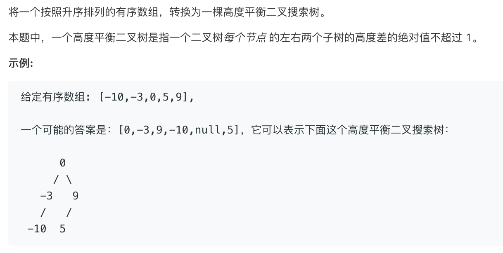

# tencent convert sorted array to binary search tree   
### 题目描述  

###  

### 解题思路

写一个平衡二叉树 然后把数组插入

或者二分

##### 先上二分

```cpp

/**
 * Definition for a binary tree node.
 * struct TreeNode {
 *     int val;
 *     TreeNode *left;
 *     TreeNode *right;
 *     TreeNode(int x) : val(x), left(NULL), right(NULL) {}
 * };
 */
class Solution {
public:
    TreeNode* sortedArrayToBST(vector<int>& nums) {
        return build(nums,0,nums.size());
    }
    TreeNode* build(vector<int>&nums,int s,int e){
        if(s>=e)return NULL;
        if(s==e-1)return new TreeNode(nums[s]);
        int mid=(s+e)/2;    
        TreeNode* root=new TreeNode(nums[mid]);
        root->left=build(nums,s,mid);
        root->right=build(nums,mid+1,e);
        return root;
    }
};

```


##### 建立平衡二叉树

```go

var height map[*TreeNode]int

func sortedArrayToBST(nums []int) *TreeNode {
	if len(nums) == 0 {
		return nil
	}
	height = make(map[*TreeNode]int)
	var root *TreeNode
	for _, v := range nums {
		root = insert(root, v)
	}
	return root
}

func insert(root *TreeNode, val int) *TreeNode {
	if root == nil {
		root = &TreeNode{val, nil, nil}
		height[root] = 1
		return root
	}

	if val > root.Val {
		root.Right = insert(root.Right, val)
		height[root] = max(Height(root.Left), Height(root.Right)) + 1
	}
	if val < root.Val {
		root.Left = insert(root.Left, val)
		height[root] = max(Height(root.Left), Height(root.Right)) + 1
	}

	if height[root.Right]-height[root.Left] > 1 {
		//RR or RL
		if height[root.Right.Right] >= height[root.Right.Left] {
			//RR
			root = LL(root)
		} else {
			//RL
			root.Right = RR(root.Right)
			root = LL(root)
		}

	} else if height[root.Right]-height[root.Left] < -1 {
		//LL or LR
		if height[root.Left.Left] >= height[root.Left.Right] {
			//LL
			root = RR(root)
		} else {
			//LR
			root.Left = LL(root.Left)
			root = RR(root)
		}
	}

	return root
}

func LL(root *TreeNode) *TreeNode {
	newRoot := root.Right
	root.Right = root.Right.Left
	newRoot.Left = root
	height[root] = max(Height(root.Left), Height(root.Right)) + 1
	height[newRoot] = max(Height(newRoot.Right), Height(newRoot.Left)) + 1
	return newRoot
}

func RR(root *TreeNode) *TreeNode {
	newRoot := root.Left
	root.Left = root.Left.Right
	newRoot.Right = root
	height[root] = max(Height(root.Left), Height(root.Right)) + 1
	height[newRoot] = max(Height(newRoot.Right), Height(newRoot.Left)) + 1
	return newRoot
}

func Height(root *TreeNode) int {
	if root == nil {
		return 0
	}
	return height[root]
}

func max(a, b int) int {
	if a > b {
		return a
	}
	return b
}
```


