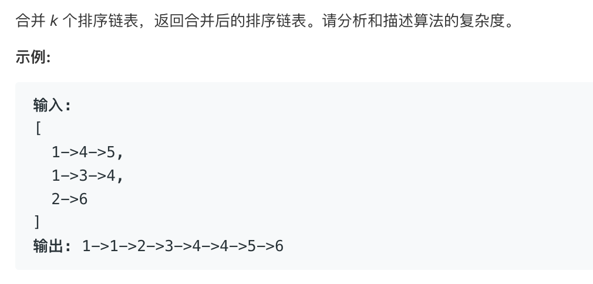

# tencent merge k sorted lists   
### 题目描述   



### 解题思路

#### 循环或者二分

##### 二分代码

```cpp

/**
 * Definition for singly-linked list.
 * struct ListNode {
 *     int val;
 *     ListNode *next;
 *     ListNode(int x) : val(x), next(NULL) {}
 * };
 */
class Solution {
public:
    ListNode* mergeKLists(vector<ListNode*>& lists) {
        return merge(lists,0,lists.size()); 
    }
    ListNode* merge(vector<ListNode*>&lists,int s,int e){
        if(s==e)return NULL;
        if(s==e-1){
            return lists[s]; 
        }
        int mid=(s+e)/2;
        
        auto l1=merge(lists,s,mid);
        auto l2=merge(lists,mid,e);

        ListNode*head=new ListNode(-1);
        ListNode*tail=head;     

        while(l1&&l2){
            if(l1->val<l2->val){
                tail->next=l1;
                l1=l1->next;
                tail=tail->next;
            }else{
                tail->next=l2;
                l2=l2->next;
                tail=tail->next;
            } 
        }

        if(l1)
            tail->next=l1;
        if(l2)
            tail->next=l2;
        
        return head->next; 
    }
    
};

```

##### 循环代码

```go

func mergeKLists(lists []*ListNode) *ListNode {
	if len(lists) == 0 {
		return nil
	}
	if len(lists) == 1 {
		return lists[0]
	}
	mid := len(lists) / 2
	one := mergeKLists(lists[:mid])
	another := mergeKLists(lists[mid:])

	if one == nil {
		return another
	}
	if another == nil {
		return one
	}

	var merge *ListNode
	var select_one *ListNode
	var tail *ListNode

	for {
		if one == nil && another == nil {
			break
		}
		if one != nil && (another == nil || another.Val > one.Val) {
			select_one = one
			one = one.Next
		} else {
			select_one = another
			another = another.Next
		}
		if merge == nil {
			merge = select_one
			tail = merge
		} else {
			tail.Next = select_one
			tail = tail.Next
		}
	}
	return merge
}

```

