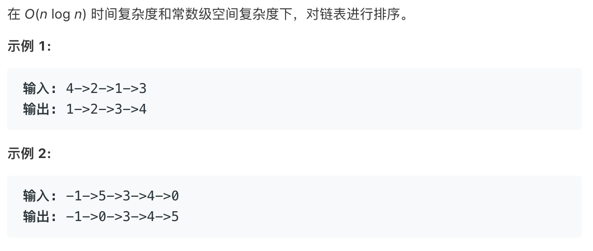

# tencent sort list   
### 题目描述   



### 解题思路

go插入+cpp(类似快排的做法

```c++
// 不知道为啥很慢 QAQ
class Solution {
public:
    ListNode* sortList(ListNode* head) {
        ListNode**h=new ListNode*;
        ListNode**t=new ListNode*;

        quick_sort(h,t,head);    

        return *h;
    }
    
    void quick_sort(ListNode**h,ListNode**tail,ListNode*head){
        if(!head||!head->next){
            *h=head;
            *tail=head?head:NULL;
            return;
        }
        auto pivot=head;
        auto cur=head->next;
        auto front=head; 
        while(cur){
            if(cur->val<pivot->val){
                front->next=cur->next;
                cur->next=head;
                head=cur;
                cur=front->next;
            }else{
                front=cur;
                cur=cur->next;
            }
        }
        
        auto pivot_next=pivot->next;
        pivot->next=NULL;  
        quick_sort(h,tail,head);
        auto f_h=*h;
        auto f_t=*tail;
        
        quick_sort(h,tail,pivot_next);
        f_t->next=*h;
        *h=f_h;
    }
};

```

```go

func sortList(head *ListNode) *ListNode {
	if head == nil || head.Next == nil {
		return head
	}

	curr := head.Next

	curr_pre := head
	for {
		if curr == nil {
			return head
		}

		var pre *ListNode
		pre = nil

		index := head

		for {
			if index.Val < curr.Val {
				pre = index
				index = index.Next
				if index == curr {
					curr_pre = curr
					curr = curr.Next
					break
				}
			} else {
				if pre == nil {
					//链表换头
					curr_pre.Next = curr.Next
					curr.Next = head
					head = curr
					curr = curr_pre.Next
					break
				} else {
					curr_pre.Next = curr.Next
					curr.Next = pre.Next
					pre.Next = curr
					curr = curr_pre.Next
					//curr_pre = 
                    break
				}
			}
		}
	}
}

```

