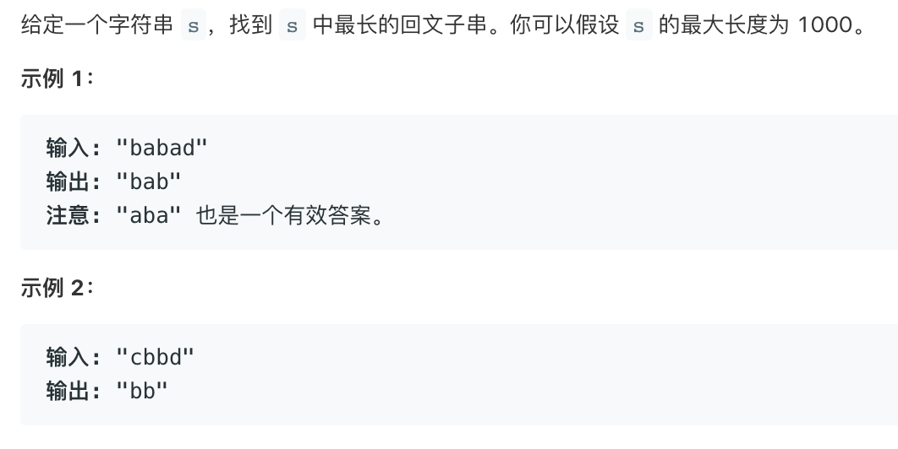

# tencent_longest_palindromic_substring   
### 题目描述   



### 解题思路

动态规划

`dp[i][j]=dp[i+1][j-1]&&s[i]==s[j]`

`dp[i][i]==true`

`dp[i][i+1]=s[i]==s[i+1]`

长度为1和2的回文串已经知道然后求长度为3、4、5……的

`for size =3 ;size<=s.length;s++`

```cpp

class Solution {
public:
    string longestPalindrome(string s) {
        int len=s.length();
        if(!len)return "";
        vector<vector<bool>>dp(len+1,vector<bool>(len+1,0));
        dp[len-1][len-1]=true;
        for(int i=0;i<len-1;i++){
            dp[i][i]=true;
            dp[i][i+1]=s[i]==s[i+1];
        }
        for(int size=3;size<=len;size++){
            for(int i=0;i+size<=len;i++){
                dp[i][i+size-1]=dp[i+1][i+size-2]&&s[i]==s[i+size-1];
            } 
        }

        int _max=1;
        int _start=0;
        for(int i=0;i<len;i++){
            for(int j=i+_max;j<len;j++){
                if(dp[i][j]){
                    _max=j-i+1;
                    _start=i;
                }
            }
        }

        return s.substr(_start,_max);
    }
};

```


```go
// v1
func longestPalindrome(s string) string {
	size := len(s)

	if size <= 1 {
		return s
	}

	dp := make([][]bool, size)

	i := 0
	j := 0

	for ; j < size; j++ {
		dp[j] = make([]bool, size)
		dp[j][j] = true
	}

	begin_ptr := 0
	end_ptr := 1

	for i = 1; i < size; i++ {
		if s[i] == s[i-1] {
			dp[i-1][i] = true
			begin_ptr = i - 1
			end_ptr = i + 1
		}
	}

	j = 0


	for cur_max := 3; cur_max <= size; cur_max++ { //枚举子串最大长度
		for i = 0; i <= size-cur_max; i++ { //枚举开始下标
			j = i + cur_max - 1
			if s[i] == s[j] && dp[i+1][j-1] == true {
				begin_ptr = i
				end_ptr = j + 1
				dp[i][j] = true
			}
		}
	}

	return s[begin_ptr:end_ptr]
}

```

```go
// v2
func longestPalindrome(s string) string {
	size := len(s)

	if size <= 1 {
		return s
	}

	max_size := 1

	b_ptr := 0
	e_ptr := 1

	for i := 1; i < len(s); i++ {
		if length := one_mid(&s, i); length > max_size {
			b_ptr = i - (length-1)/2
			e_ptr = i + (length+1)/2
			max_size = length
		}
		if s[i-1] == s[i] {
			if length := two_mid(&s, i-1, i); length > max_size {
				b_ptr = i - 1 - (length-2)/2
				e_ptr = i + (length-2)/2 + 1
				max_size = length
			}
		}
	}

	return s[b_ptr:e_ptr]
}

func one_mid(s *string, i int) int {
	length := 1
	j := i + 1
	i--
	for ; i >= 0 && j < len(*s); {
		if (*s)[i] == (*s)[j] {
			length += 2
			i--
			j++
		} else {
			break
		}
	}
	return length
}

func two_mid(s *string, i int, j int) int {
	length := 2
	i--
	j++
	for ; i >= 0 && j < len(*s); {
		if (*s)[i] == (*s)[j] {
			length += 2
			i--
			j++
		} else {
			break
		}
	}
	return length
}
```

```cpp
class Solution {
public:
    string longestPalindrome(string s) {
        if(!s.length())return "";
        int _max=1;
        int _start=0;
        int _end=0;
        for(int i=1;i<s.length();i++){
            int start=i;
            int end=i;
            for(;start>=0&&end<s.length();){ 
                if(s[start]!=s[end])break;   
                if(_max<end-start+1){
                    _max=end-start+1;
                    _start=start;
                    _end=end;
                }
                start--;
                end++;
            }
            start=i;
            end=i-1;
            for(;start>=0&&end<s.length();){ 
                if(s[start]!=s[end])break;   
                if(_max<end-start+1){
                    _max=end-start+1;
                    _start=start;
                    _end=end;
                }
                start--;
                end++;
            }
        }
        return s.substr(_start,_end-_start+1); 
    }
};
```

